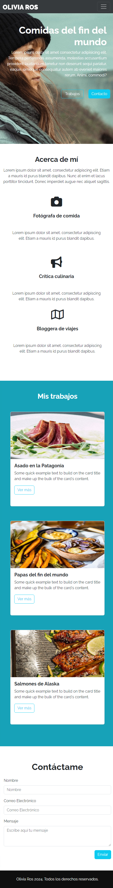

# Desafio Guiado - Olivia Ross

Este es un proyecto web para el portafolio de Olivia Ros, que presenta su trabajo en fotografía culinaria, crítica culinaria y blogging de viajes.

## Descripción

Olivia Ros es un portafolio en línea que muestra el trabajo y las habilidades de Olivia en fotografía de comida, crítica culinaria y blogging de viajes. El sitio está diseñado para proporcionar información clara sobre su experiencia, trabajos anteriores y cómo contactarla.

## Vista Codificada

A continuación, se muestra la imagen del resultado codificado:

Diseño Responsivo

## Estructura del Proyecto

El proyecto se compone de las siguientes secciones:

- **Menú de Navegación (`<nav>`)**: Contiene enlaces a las diferentes secciones de la página, incluyendo Acerca de mí, Trabajos y Contacto.
- **Encabezado (`<header>`)**: Presenta el título principal y una breve descripción de la página.
- **Sección Acerca de mí (`<section class="container text-center py-5">`)**: Proporciona información sobre Olivia y sus áreas de especialización.
- **Sección Mis trabajos (`<section class="bg-mis-trabajos py-5">`)**: Muestra una galería de trabajos anteriores con imágenes y descripciones.
- **Sección Contáctame (`<section>`)**: Incluye un formulario de contacto para que los usuarios puedan enviar mensajes.
- **Pie de Página (`<footer>`)**: Contiene un mensaje de derechos reservados.

## Tecnologías Utilizadas

- HTML5
- CSS3
- Bootstrap 5.3.2
- JavaScript (jQuery)
- Google Fonts (Raleway)
- Font Awesome

## Autor

Este proyecto fue desarrollado por **Valeria Torrealba**.
